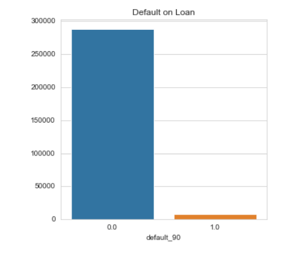
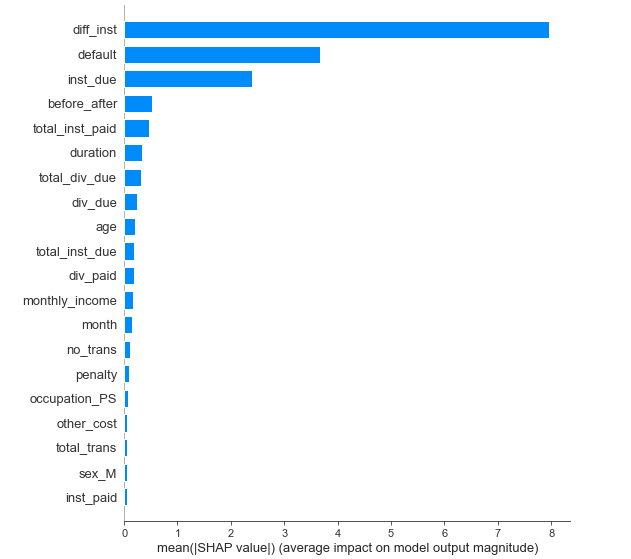
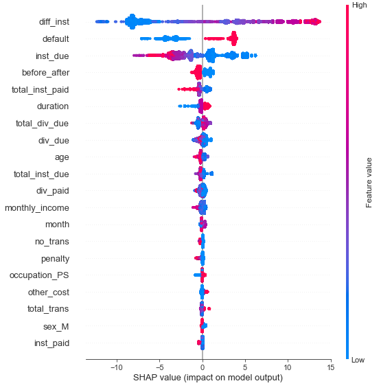
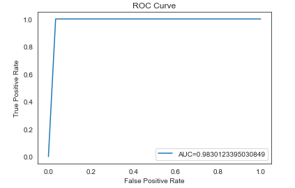
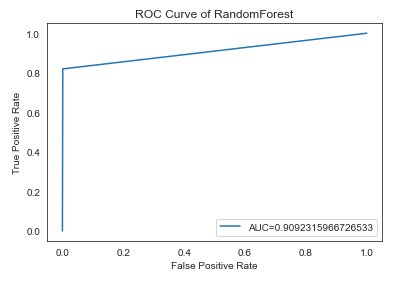
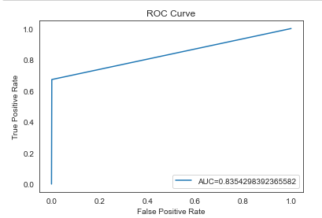
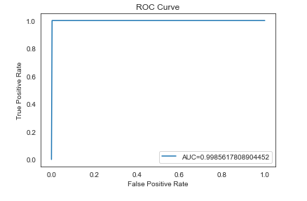

# Explainable Credit Scoring for Financial Inclusion

## Overview

This project develops an explainable machine learning credit scoring system using transaction data from chit funds in India.

The objective is to help financial institutions in developing countries improve lending decisions using machine learning while maintaining transparency and fairness.

The project applies ensemble learning models including:

- Random Forest
- AdaBoost
- Gradient Boosting
- XGBoost

The best-performing model achieved an AUC score of 0.99.

Additionally, SHAP (SHapley Additive Explanations) was used to interpret the model and identify the most influential features driving credit default predictions.

---

## Business Problem

Many developing countries lack reliable credit bureaus and formal financial histories.

As a result:

- Loan approval processes are slow
- Lending decisions are subjective
- Millions remain financially excluded
- Financial institutions face increased credit risk

This project demonstrates how explainable AI can improve financial inclusion through accurate and transparent credit scoring.

---

## Dataset

The dataset contains transaction-level data from chit funds operating in India gotten from [Harvard Dataverse](https://dataverse.harvard.edu/dataset.xhtml?persistentId=doi:10.7910/DVN/GWOTGE)

### Dataset Characteristics

- ~295,000 observations
- 57 features
- Transaction and borrower behaviour data
- Highly imbalanced target variable
  

### Key Features

| Feature | Description |
|---|---|
| monthly_income | Monthly income of borrower |
| chit_value | Loan amount |
| diff_inst | Difference between installments due and paid |
| default | Monthly contribution default |
| inst_due | Installment due |
| total_inst_paid | Total installments paid |

---

## Machine Learning Workflow

### 1. Data Understanding

- Exploratory Data Analysis
- Missing value analysis
- Outlier detection
- Class imbalance assessment

### 2. Data Preprocessing

- Missing value handling
- Outlier removal
- Feature selection
- One-hot encoding
- Standardization
- Upsampling minority class

### 3. Model Training

The following ensemble learning models were trained:

| Model | Type |
|---|---|
| Random Forest | Bagging |
| AdaBoost | Boosting |
| Gradient Boosting | Boosting |
| XGBoost | Advanced Gradient Boosting |

---

## Model Performance

| Model | Accuracy | Precision | Recall | AUC |
|---|---|---|---|---|
| Random Forest | 99% | 46% | 82% | 0.91 |
| AdaBoost | 96% | 3.7% | 100% | 0.98 |
| Gradient Boost | 99% | 40% | 68% | 0.84 |
| XGBoost | 99% | 31% | 100% | 0.99 |

### Best Model

XGBoost achieved the highest performance with:

- AUC = 0.99
- Recall = 100%

This indicates exceptional ability to distinguish between defaulters and non-defaulters.

## Model Explainability (XAI)

One of the most important aspects of this project is explainable AI.

Financial systems require transparency to ensure:

- fairness
- accountability
- regulatory compliance
- trust in automated decisions

SHAP was used to:

- explain global model behaviour
- explain individual predictions
- identify the most important risk factors

### Most Important Features

The model identified these features as the strongest predictors of default risk:

1. diff_inst
2. default
3. inst_due
   

### Key Insight

Borrowers with:

- larger unpaid installment differences
- repeated monthly defaults

were significantly more likely to default on loans.

## Some Visualizations

### ROC Curves

 
 

## Business Impact

This system can help financial institutions:

- reduce lending risk
- automate loan assessments
- improve decision turnaround time
- increase access to credit
- improve financial inclusion

## Future Improvements

Potential improvements include:

- Deep Learning models
- Real-time credit scoring API
- Streamlit dashboard deployment
- Alternative data integration
- Bias and fairness testing

## Key Data Science Skills Demonstrated

### Data Analysis

- Exploratory Data Analysis
- Feature Engineering
- Statistical Interpretation

### Machine Learning

- Ensemble Learning
- Classification
- Model Evaluation
- Hyperparameter Tuning

### Explainable AI

- SHAP
- Feature Importance
- Local & Global Interpretability

### Software Engineering

- Modular project structure
- Reproducible workflow
- GitHub version control

## Research Foundation

This project is based on a master's dissertation focused on using machine learning for credit scoring in developing economies.

Research areas include:

- Financial inclusion
- Credit risk analytics
- Explainable AI
- FinTech innovation

---

## Author

Angela Lum-Neh

Data Scientist | FinTech Professional | AI & Financial Inclusion Enthusiast

### Connect With Me

- LinkedIn: https://www.linkedin.com/in/lumnehangela/

